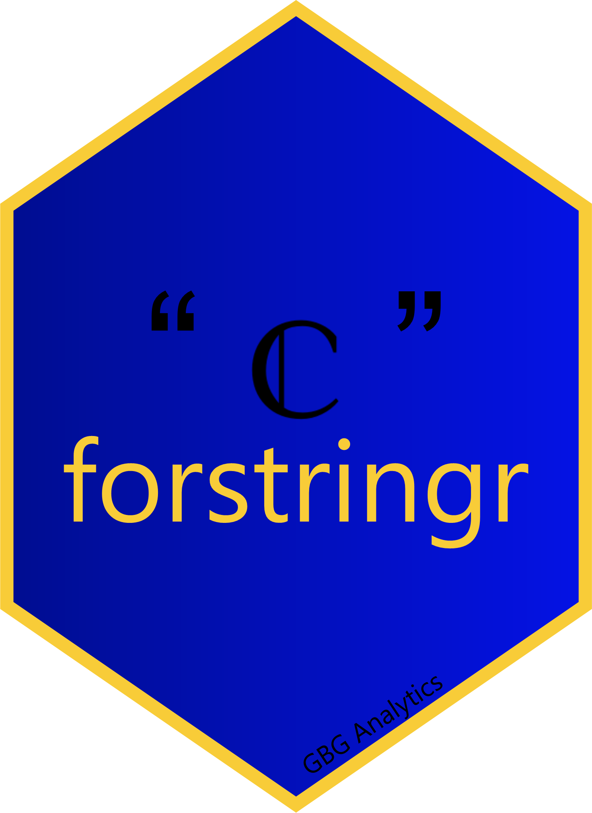

<!-- README.md is generated from README.Rmd. Please edit that file -->

# forstringr presentation 

<!-- badges: start -->
<!-- badges: end -->

The string (or character) data type typically requires more manipulation
to be helpful for data analysts. Thus, there is a need for a robust
package that is up to the task. **forstringr** is a new package built on
top of stringr to execute various string manipulations in R programming.
The main aim of forstringr is to simplify string manipulation for R
beginners. This package combines its power with the adaptability of
other manipulation tools such as tidyr and dplyr. Like in the stringr
package, most functions in `forstringr` begin with `str_`.

**forstringr repo**: <https://github.com/gbganalyst/forstringr>

**forstringr presentation slide**: <https://bit.ly/forstringr-presentation-slide>
