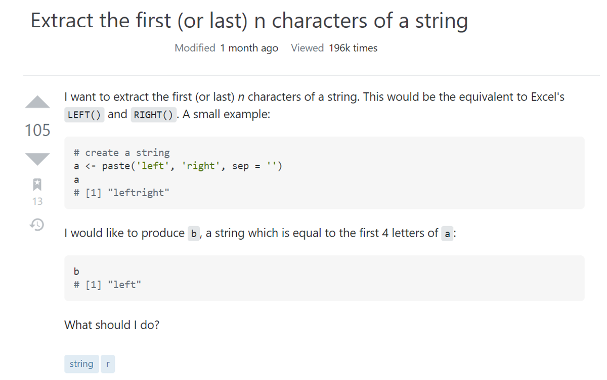
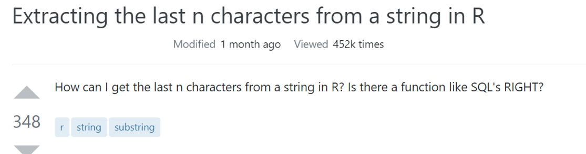
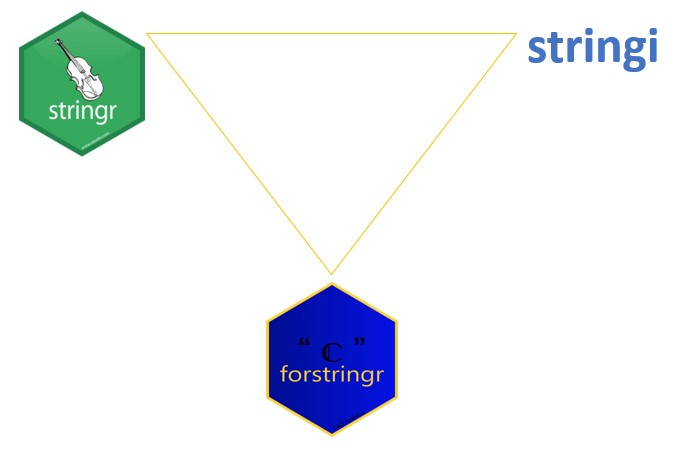
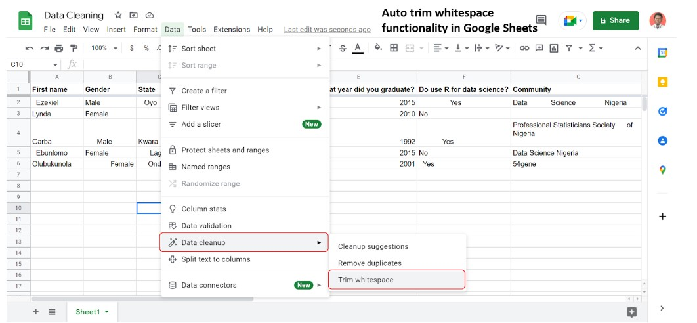

---
output:
  xaringan::moon_reader:
    yolo: false
    lib_dir: libs
    css: xaringan-themer.css
    seal: false
    nature:
      #autoplay: 30000
      #countdown: 60000
      highlightStyle: github
      highlightLines: true
      highlightSpans: true
      countIncrementalSlides: false
      #ratio: 16:9
      slideNumberFormat: "%current%"
editor_options: 
  chunk_output_type: console
---

```{r setup, include=FALSE}
options(htmltools.dir.version = FALSE)

knitr::opts_chunk$set(echo = TRUE, 
                      tidy = 'styler', 
                      comment = NA,
                      message = FALSE,
                      warning = FALSE)
```


```{r xaringan-themer, include=FALSE, warning=FALSE}
library(xaringanthemer)
style_duo_accent(
  primary_color = "#1381B0",
  secondary_color = "#FF961C",
  inverse_header_color = "#FFFFFF"
)

# Loaded packages

install.load::install_load(c("knitr", "xaringanExtra", "xaringan", "tidyverse", "kableExtra", "countdown", "janitor", "forstringr"))

xaringanExtra::use_xaringan_extra(include = c("tile_view", "editable", "share_again", "broadcast", "animate_css", "panelset", "tachyons", "fit_screen", "clipboard", "search", "scribble", "freezeframe"))

use_webcam(width = 150, height = 150)

use_extra_styles()

```

background-image: url(images/logo.png), url(images/afri_logo.png)
background-position: 0% 100%, 100% 0%
background-size: 10%, 10%

class: title-page, center, middle

## String manipulation using forstringr package

```{r, echo=FALSE}
use_logo(
  image_url = "images/logo.png",
  link_url = "https://bit.ly/gbganalyst",
  position = xaringanExtra::css_position(top = "1em", right = "1em"),
  exclude_class = c("title-page", "inverse", "hide_logo")
)
```

---
class: about-me-slide, inverse, middle, center

## About Me


### Ezekiel Adebayo Ogundepo

#### Data Specialist

.fade[54gene<br>Lagos, Nigeria]


[`r icons::fontawesome("link")` https://bit.ly/gbganalyst](https://bit.ly/gbganalyst)
[`r icons::fontawesome("twitter")` @gbganalyst](https://twitter.com/gbganalyst)
[`r icons::icon_style(icons::fontawesome("github"), scale = 1)` @gbganalyst](https://github.com/gbganalyst)

---
class: inverse, middle, center

## Why `forstringr` package?

```{r, echo=FALSE, fig.align='center', out.height= "25%", out.width= "30%"}
knitr::include_graphics("images/logo.png")
```

---
class: middle

## Why `forstringr` package?

```{r, echo=FALSE, fig.align='center'}

```

Source: [stackoverflow](https://stackoverflow.com/questions/15897236/extract-the-first-or-last-n-characters-of-a-string/63615311#63615311)

---
class: middle

## Why `forstringr` package?

```{r, echo=FALSE, fig.align='center'}

```

Source: [stackoverflow](https://stackoverflow.com/questions/7963898/extracting-the-last-n-characters-from-a-string-in-r/63615027#63615027)


---
class: middle, hide_logo

.w-100.lh-copy[

Goal:

> The goal of forstringr is to enable complex string manipulation in R easier for the beginners. The package combines the power of stringr with other manipulation packages such as dplyr and tidyr. Just like in the stringr package, most functions in forstringr begin with `str_`.
]


```{r, echo=FALSE, fig.align='center'}

```

---
class: inverse, middle
name: toc

## Functions in the forstringr package

- [`length_omit_na()`](#fn1)

--

.pull-left[
Substring extraction functions:

- [`str_left()`](#fn2)

- [`str_right()`](#fn3)

- [`str_mid()`](#fn4)
]

--

.pull-right[

- [`str_split_extract()`](#fn5)

- [`str_extract_part()`](#fn6)

- [`str_rm_whitespace_df()`](#fn7)

]

---
class: middle

## How to install `forstringr`

You can install the development version of forstringr from GitHub with:

```{r, eval=FALSE}
if(!require("devtools")){
 install.packages("devtools")
}

devtools::install_github("gbganalyst/forstringr")
```

---
class: inverse, middle, center
name: fn1

## `length_omit_na()`

```{r, echo=FALSE, fig.align='center', out.height= "25%", out.width= "30%"}
knitr::include_graphics("images/logo.png")
```

---
class: middle

## `length_omit_na()`

`length_omitna()` counts only non-missing elements in a vector.

**Example 1**:

```{r}
fruits <- c("Date", "Mangoes", "Apples",  "Pineapples", NA, "Bananas", 
"African cherry", "Matoke", NA, "Tamarind")

length(`fruits`)

length_omit_na(`fruits`)
```

---

## `length_omit_na()`

**Example 2**:

```{r}
drug_list <- read_csv("data/list of drugs.csv")
```

```{r, include=FALSE}
drug_list <-  kableExtra::kable(drug_list)
```


```{r}
drug_list
```

---
## `length_omit_na()`

```{r, include=FALSE}
drug_list <- read_csv("data/list of drugs.csv")
```

```{r}
total_drugs <-  drug_list %>%
  rowwise() %>%
  mutate(`total` = length_omit_na(unique(c_across(`drug_1`:`drug_5`))))
```

```{r, include=FALSE}
total_drugs <- total_drugs %>% 
  kable()
```

```{r}
total_drugs
```

---
class: inverse, middle, center
name: fn2

## `str_left()`

```{r, echo=FALSE, fig.align='center', out.height= "25%", out.width= "30%"}
knitr::include_graphics("images/logo.png")
```

---
class: middle

# `str_left()`

Given a character vector, `str_left()` returns the left side of a string. For examples:

**Example 1**:

```{r}

str_left("Nigeria")

str_left("Ghana", n = 2)

str_left(c("Female", "Male", "Male", "Female"))

```

---

## `str_left()`

**Example 2**:

```{r}
disease_subtype <- read_csv("data/ICD-10.csv")
```

```{r, include=FALSE}
disease_subtype <- disease_subtype %>% kable()
```


```{r}
disease_subtype 
```

---

## `str_left()`

```{r}
disease_subtype <- read_csv("data/ICD-10.csv")
```


```{r}
disease_subtype <- disease_subtype %>% 
  mutate(`ICD-10` = str_left(`Disease Subtype`, 3)) %>% relocate(`ICD-10`, .before = Count)

```

```{r, include=FALSE}
disease_subtype <- disease_subtype %>% 
  kable()
```

```{r}
disease_subtype
```

---
class: inverse, middle, center
name: fn3

## `str_right()`

```{r, echo=FALSE, fig.align='center', out.height= "25%", out.width= "30%"}
knitr::include_graphics("images/logo.png")
```

---

## `str_right()`

Given a character vector, `str_right()` returns the right side of a string.

**Example 1**:

```{r}
str_right("July 20, 2022", 4)

str_right("Sale Price", n = 5)

```
---

## `str_right()`

**Example 2**:

```{r}
penguins_visit <- read_csv("data/penguins-visits.csv")
```

```{r, include=FALSE}
penguins_visit <- penguins_visit %>% kable()
```


```{r}
penguins_visit
```

---

## `str_right()`

```{r}
penguins_visit <- read_csv("data/penguins-visits.csv")
```

```{r}
penguins_visit <- penguins_visit %>% 
  mutate(`temperature_scale` = str_right(`temperature`)) 
```

```{r, include=FALSE}
penguins_visit <- penguins_visit %>% 
  kable()
```

```{r}
penguins_visit
```

---
class: inverse, middle, center
name: fn4

## `str_mid()`

```{r, echo=FALSE, fig.align='center', out.height= "25%", out.width= "30%"}
knitr::include_graphics("images/logo.png")
```
---

## `str_mid()`

Like in Microsoft Excel, the `str_mid()` returns a specific number of characters from a text string, starting at the position you specify, based on the number of characters you select.

**Example 1**:

```{r}
str_mid("Super Eagle", 7, 5)

str_mid("Oyo Ibadan", 5, 6)
```

---
## `str_mid()`

**Example 2**:

```{r}
error_message <- read_csv("data/Error message.csv")
```

```{r, include=FALSE}
error_message <- error_message %>% 
  kable()
```


```{r}
error_message
```

---

## `str_mid()`

```{r}
error_message <- read_csv("data/Error message.csv")
```

```{r}
error_message <- error_message %>% 
  mutate(`error_code` = str_mid(`source_string`, start = 7, n = 3)) 
```

```{r, include=FALSE}
error_message <- error_message %>% 
  kable()
```

```{r}
error_message
```

---
class: inverse, middle, center
name: fn5

## `str_split_extract()`

```{r, echo=FALSE, fig.align='center', out.height= "25%", out.width= "30%"}
knitr::include_graphics("images/logo.png")
```

---

## `str_split_extract()`

If you want to split up a string into pieces and extract the results using a specific index position, then, you will use `str_split_extract()`. You can interpret it as follows:

Given a character string, `S`, extract the element at a given position, `k`, from the result of splitting `S` by a given pattern, `m`. 

**Example 1**:

```{r}
top_10_richest_nig <- c("Aliko Dangote", "Mike Adenuga", "Femi Otedola", "Arthur Eze", "Abdulsamad Rabiu", "Cletus Ibeto", "Orji Uzor Kalu", "ABC Orjiakor", "Jimoh Ibrahim", "Tony Elumelu")

first_name <- str_split_extract(top_10_richest_nig, pattern = " ", position = 1)

first_name
```

---
## `str_split_extract()`

**Example 2**:

```{r}
product_category <- read_csv("data/product_categories.csv")
```

```{r, include=FALSE}
product_category <- product_category %>% 
  kable()
```


```{r}
product_category
```

---

## `str_split_extract()`

Let's extract the city from the product key:

```{r, include=FALSE}
product_category <- read_csv("data/product_categories.csv")
```

```{r}
product_category <- product_category %>% 
  mutate(`city` = str_split_extract(`product_key`, pattern = "-", position = 3)) 
```

```{r, include=FALSE}
product_category <- product_category %>% 
  kable()
```

```{r}
product_category
```

---
class: inverse, middle, center
name: fn6

## `str_extract_part()`

```{r, echo=FALSE, fig.align='center', out.height= "25%", out.width= "30%"}
knitr::include_graphics("images/logo.png")
```

---
## `str_extract_part()`

Extract strings before or after a given pattern. 

**Example 1**:

```{r}
first_name <- str_extract_part(top_10_richest_nig, before = TRUE, pattern =  " ")

revenue <- c("$159", "$587", "$891", "$207", "$793")

str_extract_part(revenue, before = FALSE, pattern = "$")
```

---
## `str_extract_part()`

**Example 2**:

```{r}
data4email <- read_csv("data/data4email.csv")
```

```{r, include=FALSE}
data4email <- data4email %>% 
  kable()
```


```{r}
data4email
```

---

## `str_extract_part()`

Let's create email using the first name from the data:

```{r}
data4email <- read_csv("data/data4email.csv")
```

```{r}
data4email <- data4email %>%
  mutate(`first_name` = str_extract_part(`full_name`, before = TRUE, pattern = " "), `email` = str_c(`first_name`, `domain`))
```

```{r, include=FALSE}
data4email <- data4email %>% 
  kable()
```

```{r}
data4email
```

---
class: inverse, middle, center
name: fn7

## `str_rm_whitespace_df()`

```{r, echo=FALSE, fig.align='center', out.height= "25%", out.width= "30%"}
knitr::include_graphics("images/logo.png")
```

---

## `str_rm_whitespace_df()`

.w-100.lh-copy[
Extra spaces are accidentally entered when working with survey data, and problems can arise when evaluating such data because of extra spaces. Therefore, the function `str_rm_whitespace_df()` eliminates your data frame unnecessary leading, trailing, or other whitespaces.]

--

```{r, echo=FALSE}

```

---
## `str_rm_whitespace_df()`

**Example 1**:

```{r}
richest_in_nigeria
```

---

## `str_rm_whitespace_df()`

```{r, include=FALSE}
richest_in_nigeria <-  richest_in_nigeria %>%
  kable()
```

```{r, eval=FALSE}
str_rm_whitespace_df(richest_in_nigeria)
```

```{r, echo=FALSE}
richest_in_nigeria
```

---
class: inverse, middle, center


## How to contribute 

```{r, echo=FALSE, fig.align='center', out.height= "25%", out.width= "30%"}
knitr::include_graphics("images/logo.png")
```

---
class: middle

## How to contribute?

You can contribute to the development of this package by:

.w-100.lh-copy[

- filing an issue if you detect a bug  https://github.com/gbganalyst/forstringr/issues.

]

--

.w-100.lh-copy[

- if you have any other function that can manipulate strings but does not already exist in any R package, you can also file an issue or create a pull request.

]


---
class: center, middle, inverse

# The end

--

**Thank you**
